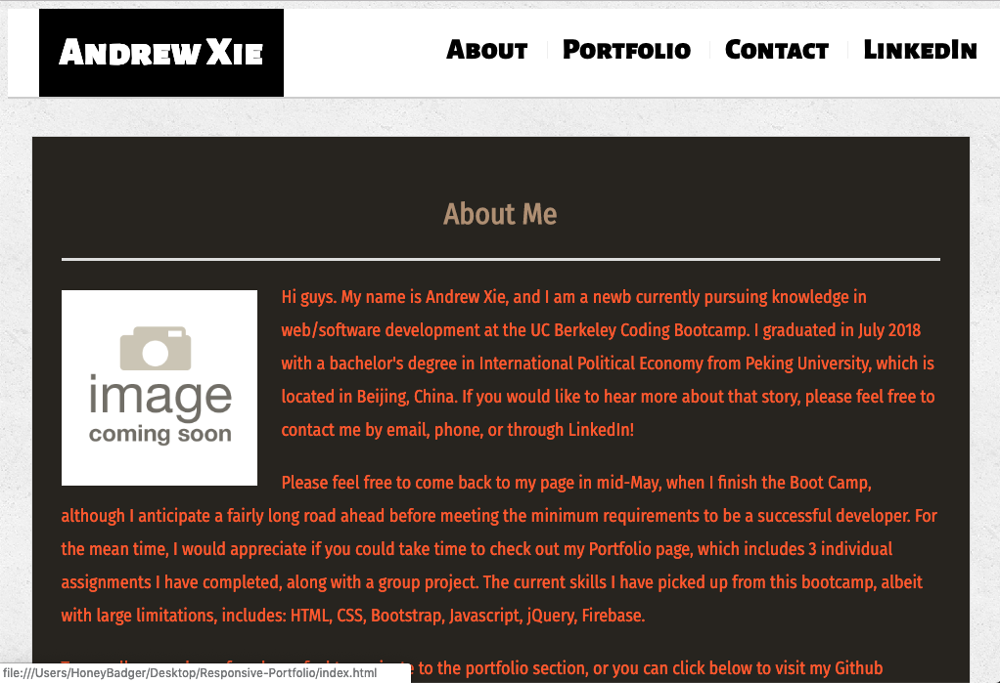

# Andrew Xie

## Link to my portfolio
Code link: https://github.com/Xieandrew2235/Responsive-Portfolio
 
Deployed link: https://xieandrew2235.github.io/Responsive-Portfolio/
 

### How I put this (updated) portfolio together

By recycling my Responsive Portfolio, I was able to update my portfolio with a much more detailed "About Me", which includes a link to my Github repository, my email, and my number. In the portfolio section I included screenshots of 3 homework assignments, along with Project 1, and their respective links to the code and the deployed version. My LinkedIn is also added into my updated profile (in the navbar), but I still have a lot of work to do to clean up my LinkedIn page. Another addition I made was adding Google Fonts to this page, along with different colors and adjustments to the css sheet.

### What I did not complete

* The portfolio is mobile-responsive, but for the image placeholder I used in the about me section, it shrinks to a large size, which was a problem I originally had with my Responsive Portfolio that I was not able to fix, even with the assistance of the TA's and classmates.

* The screenshots in "Portfolio" section are also poorly sized, which I've been trying to fix for a bit with Google Inspect but have not gotten them to all work at the same size yet, similiar to an issue I had with the GifTastic assignment.

* I wanted to make the submit button send an email to a designed email address, but so far it hasn't worked. I found some logic online that I was trying out but it didn't send me an email upon clicking the submit button.

